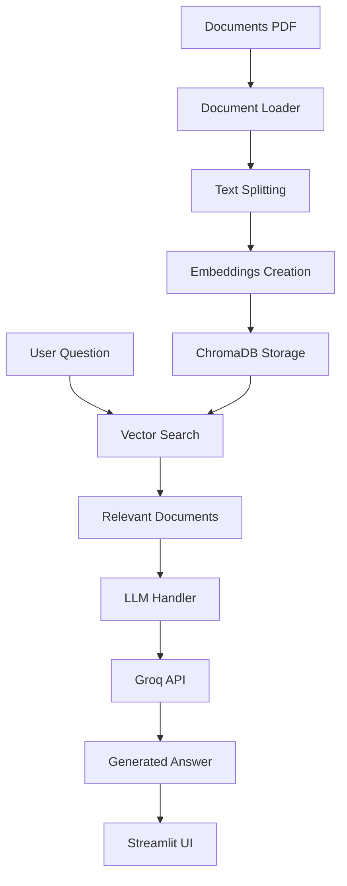

# 📁 Structure du Projet RAG

## 🎯 Vue d'ensemble

Ce projet implémente un système RAG (Retrieval-Augmented Generation) professionnel pour interroger des documents PDF scientifiques.

## 📂 Structure des fichiers

```
mon_rag_project/
├── 📁 src/                          # Code source principal
│   ├── __init__.py                  # Initialisation du package
│   ├── config.py                    # Configuration centralisée
│   ├── document_loader.py           # Chargement et traitement des PDFs
│   ├── vectorstore.py               # Gestion ChromaDB
│   ├── llm_handler.py               # Interface avec Groq API
│   └── rag_pipeline.py              # Pipeline RAG principal
├── 📁 data/                         # Données du projet
│   └── 📁 documents/                # Dossier pour les PDFs
│       ├── .gitkeep                 # Maintient le dossier dans git
│       └── README_DOCUMENTS.md      # Instructions pour les documents
├── 📁 chroma_db/                    # Base vectorielle persistante (ignorée par git)
├── 📄 app.py                        # Application Streamlit principale
├── 📄 requirements.txt              # Dépendances Python
├── 📄 .env.example                  # Template de configuration
├── 📄 .gitignore                    # Fichiers ignorés par git
├── 📄 README.md                     # Documentation principale
├── 📄 deploy.py                     # Script de déploiement
├── 📄 start.py                      # Script de démarrage rapide
├── 📄 test_installation.py          # Tests d'installation
└── 📄 PROJECT_STRUCTURE.md          # Ce fichier
```

## 🔧 Modules principaux

### `src/config.py`
- **Rôle** : Configuration centralisée du projet
- **Fonctionnalités** :
  - Chemins de fichiers et répertoires
  - Paramètres RAG (taille chunks, overlap, etc.)
  - Configuration API Groq
  - Messages d'erreur et de succès
  - Validation de la configuration

### `src/document_loader.py`
- **Rôle** : Chargement et traitement des documents PDF
- **Fonctionnalités** :
  - Extraction de texte avec PyPDF2
  - Découpage intelligent en chunks
  - Nettoyage du texte
  - Mapping page -> contenu
  - Gestion des erreurs de lecture

### `src/vectorstore.py`
- **Rôle** : Gestion de la base vectorielle ChromaDB
- **Fonctionnalités** :
  - Création et chargement des embeddings
  - Persistance locale
  - Recherche de similarité
  - Gestion du cache
  - Interface LangChain

### `src/llm_handler.py`
- **Rôle** : Interface avec l'API Groq
- **Fonctionnalités** :
  - Client Groq intégré
  - Gestion des prompts RAG
  - Configuration des paramètres LLM
  - Test de connexion
  - Gestion d'erreurs

### `src/rag_pipeline.py`
- **Rôle** : Orchestration du pipeline RAG complet
- **Fonctionnalités** :
  - Initialisation du système
  - Recherche de documents pertinents
  - Génération de réponses
  - Calcul de confiance
  - Gestion des sources

## 🌐 Application Streamlit

### `app.py`
- **Interface utilisateur** moderne et intuitive
- **Fonctionnalités** :
  - Upload et gestion des documents
  - Interface de questions/réponses
  - Historique de conversation
  - Affichage des sources avec numéros de page
  - Métriques de performance
  - Gestion d'état de session

## 🚀 Scripts utilitaires

### `deploy.py`
- **Déploiement automatisé** du projet
- **Fonctionnalités** :
  - Création d'environnement virtuel
  - Installation des dépendances
  - Configuration des fichiers
  - Tests d'installation
  - Instructions de démarrage

### `start.py`
- **Démarrage rapide** avec vérifications
- **Fonctionnalités** :
  - Vérification de l'environnement
  - Test des dépendances
  - Validation de la configuration
  - Lancement automatique de Streamlit

### `test_installation.py`
- **Tests complets** du système
- **Fonctionnalités** :
  - Test des importations
  - Validation de la configuration
  - Test des modules individuels
  - Rapport de statut détaillé

## 📊 Flux de données



## 🔒 Sécurité et bonnes pratiques

- **Variables d'environnement** : Clés API dans `.env` (non versionnées)
- **Gitignore** : Exclusion des données sensibles et du cache
- **Gestion d'erreurs** : Try/catch complets avec messages clairs
- **Logging** : Traçabilité des opérations
- **Documentation** : Docstrings Google style

## 🎯 Points d'extension

Le projet est conçu pour être facilement extensible :

1. **Nouveaux types de documents** : Modifier `document_loader.py`
2. **Autres LLM** : Adapter `llm_handler.py`
3. **Nouvelles bases vectorielles** : Modifier `vectorstore.py`
4. **Interface différente** : Remplacer `app.py`
5. **Nouveaux paramètres** : Étendre `config.py`

## 📈 Performance

- **Premier lancement** : ~30-60s (création embeddings)
- **Lancements suivants** : ~5-10s (cache)
- **Réponses** : ~2-5s (selon complexité)
- **Mémoire** : Optimisé pour ressources limitées
- **Stockage** : Base vectorielle persistante locale
